# DMIT Japan Optimized VPS EB.STARTER: Real-World Speed & Performance Review

---

Looking for a Japan VPS that actually connects well to mainland China? The DMIT Tokyo Eyeball Network series uses CMI routing for all three carriers' return paths. Let's see how the EB.STARTER plan performs in real testing—including CPU power, network speeds, streaming capabilities, and routing quality.

---

The EB.STARTER configuration we're testing: 1 CPU core, 2GB RAM, 40GB SSD, 2TB monthly bandwidth, 2Gbps port, 1 IPv6 + 1 IPv4 address, priced at $55.90/year.

## CPU and Disk I/O Performance

The server runs on an AMD EPYC 7443P 24-Core Processor. Our disk I/O test clocked in at around 716.0 MB/s—pretty solid for everyday workloads.

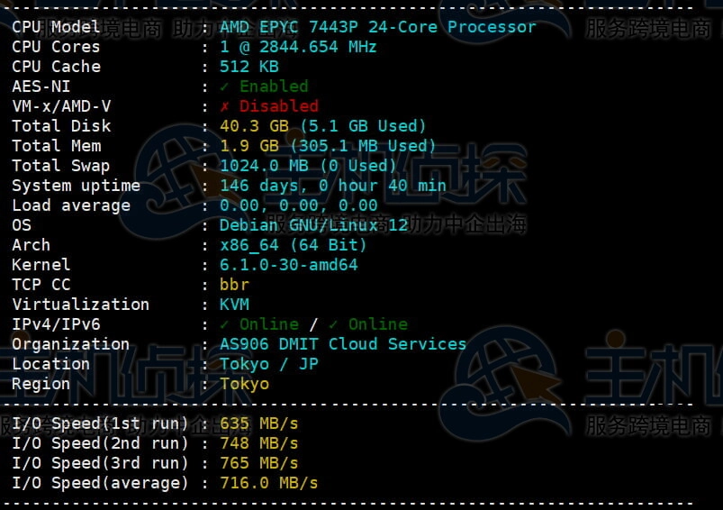

## Upload and Download Speed Tests

Average upload speed across global test points hit 1000Mbps, while download speeds averaged around 1400Mbps. These numbers show the 2Gbps port is being well utilized.

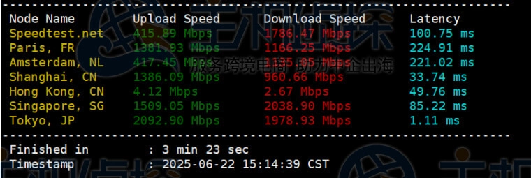

## Streaming Service Unlock Tests

The Eyeball Network plan successfully unlocks YouTube, Netflix, Amazon Prime Video, and other major streaming platforms. Good news if you're planning to use this for media access.

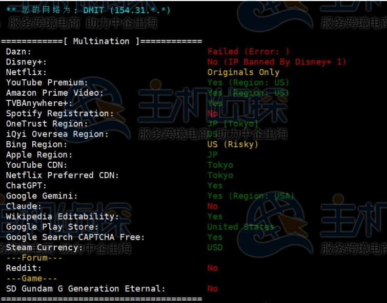

## Fio and iperf3 Benchmarks

Here's the detailed storage and network performance data:

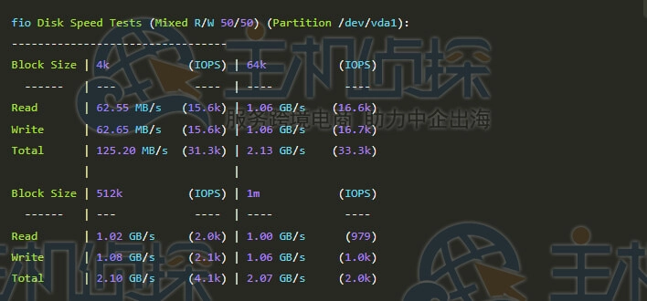

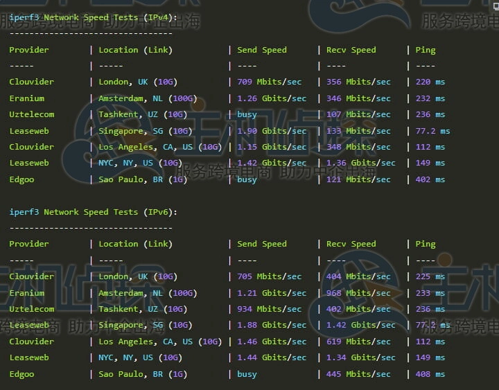

## Return Route Analysis

This is where things get interesting for China users. For anyone needing reliable Japan-to-China connectivity, the routing setup can make or break your experience. 👉 [Want a Japan VPS with optimized China routes? Check out DMIT's direct CMI connections](https://www.dmit.io/aff.php?aff=13832)

**1. China Telecom Return Path**

Telecom traffic routes back to China via CMI (China Mobile International) direct connection.

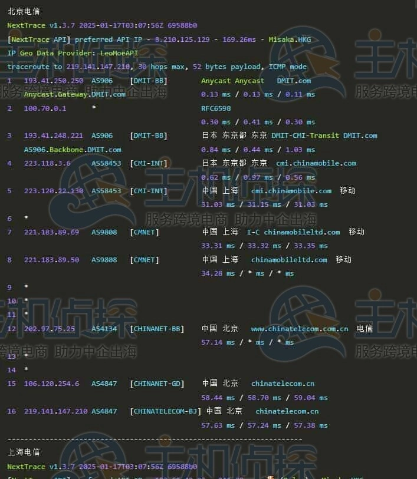

**2. China Unicom Return Path**

Unicom also gets CMI direct routing back to mainland China.

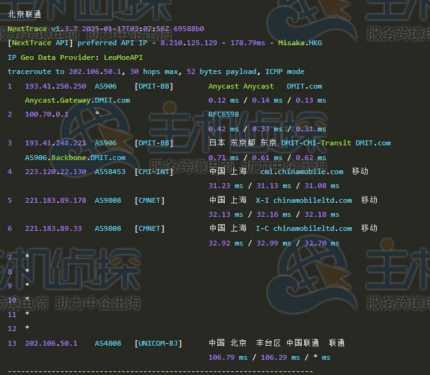

**3. China Mobile Return Path**

Mobile naturally uses its own CMI infrastructure for direct connectivity.

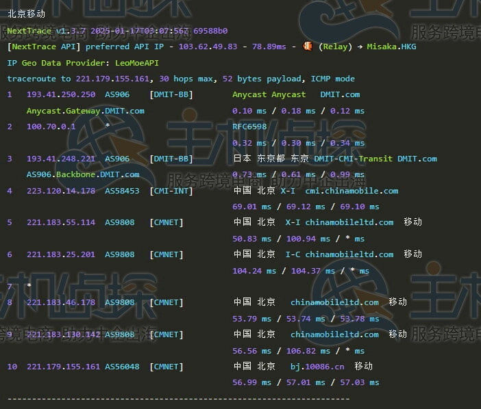

All three major carriers get direct CMI routing—no complicated detours or congestion points. This consistency is exactly what you want for stable China connections.

## Ping Latency Tests

Average latency from the Tokyo server to various regions in mainland China came in at 68ms. That's reasonable for cross-border connections.

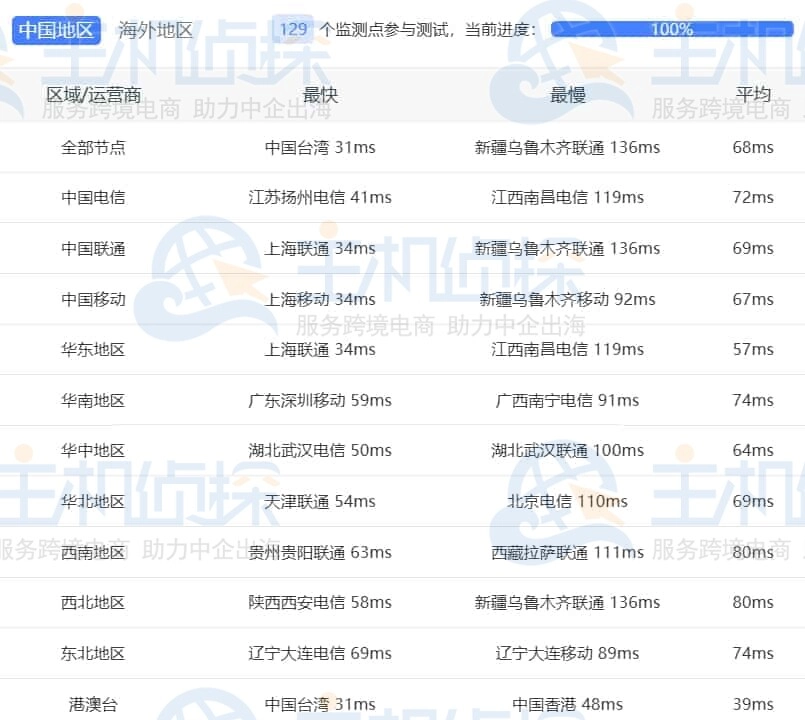

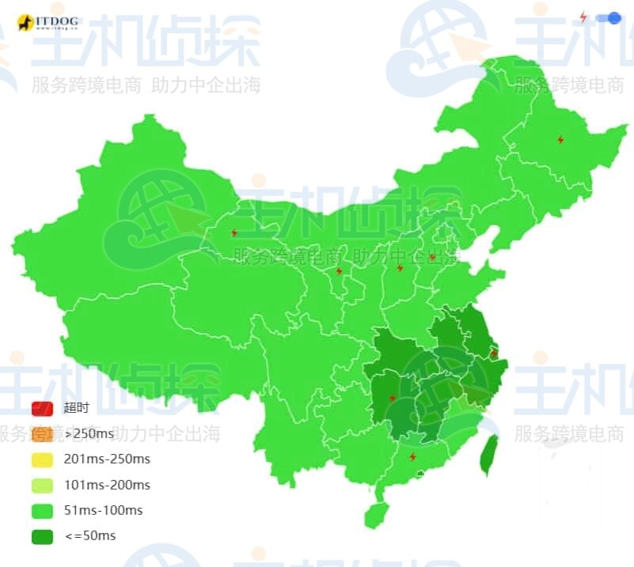

## IP Quality Report

The IPv4 address tested as a native IP, while IPv6 showed up as a broadcast IP. Native IPs generally work better for services that care about geolocation.

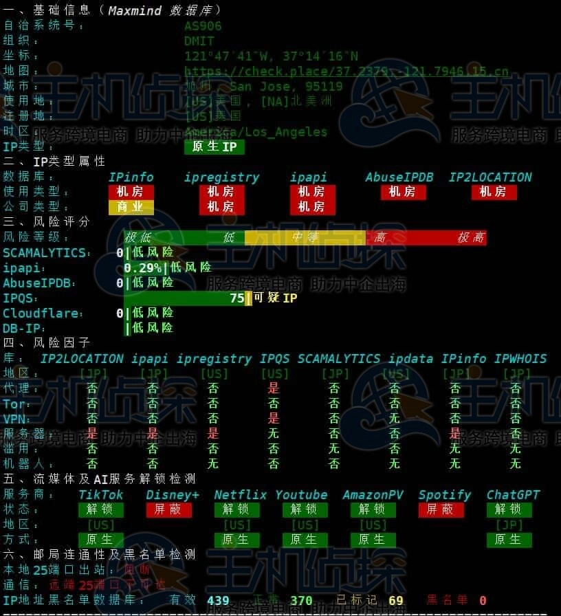

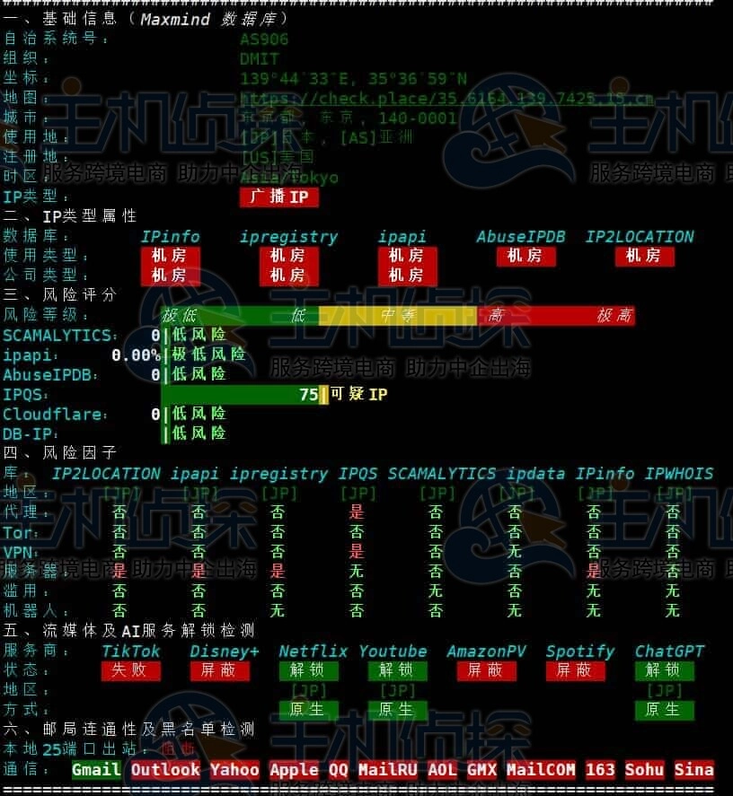

---

## Bottom Line

The EB.STARTER plan delivers what it promises: consistent CMI routing for all three Chinese carriers, decent hardware specs, and streaming unlock capability. At 68ms average latency and native IPv4, it's a practical choice for applications requiring stable Japan-to-China connectivity. If you need predictable routing without the premium tier pricing, 👉 [DMIT's Eyeball Network series offers solid China-optimized performance](https://www.dmit.io/aff.php?aff=13832) worth considering for your next Japan VPS deployment.
